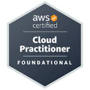
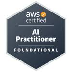
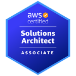
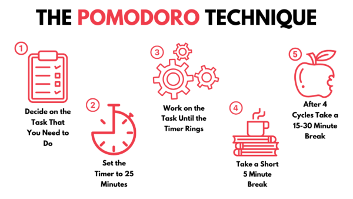
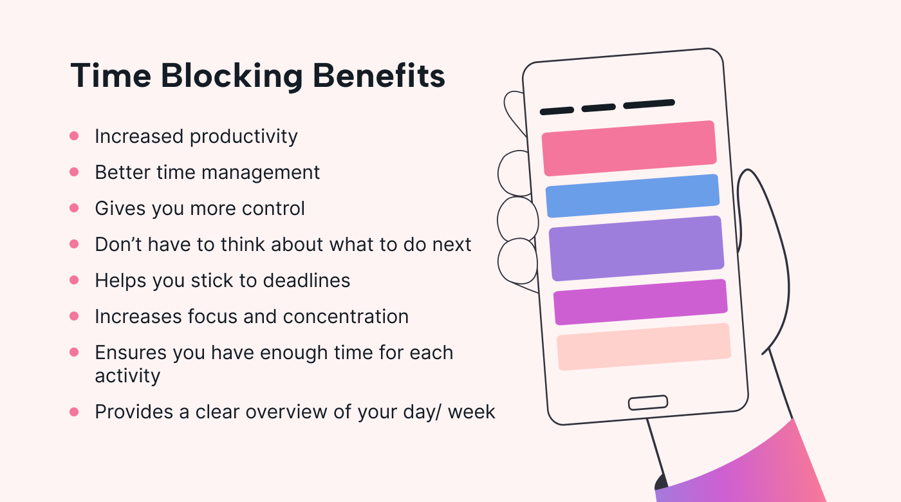
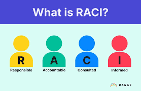

## Become a Solutions Architect Associate

 
#### Milestone 1: Pass the AWS Certified Solutions Architect Associate Exam

Preparation: Study AWS services, architecture, and best practices.
Practice: Take practice exams to assess your knowledge.
Review: Identify areas for improvement and focus on them.

#### Milestone 2: Gain Hands-On Experience

Build projects: Create and deploy AWS solutions using free tier accounts or practice environments.
Experiment: Try different AWS services and architectures.
Learn from mistakes: Analyze and address any challenges you encounter.

#### Milestone 3: Deepen Understanding of AWS Services

Learn core services: Master EC2, S3, VPC, Lambda, and other fundamental services.
Explore advanced features: Understand options like auto-scaling, load balancing, and security best practices.
Stay updated: Keep track of new services and features released by AWS.

#### Milestone 4: Develop Architectural Skills

Learn design patterns: Understand common architectural patterns like microservices, serverless, and event-driven.
Practice designing solutions: Create architectural diagrams and explain your design choices.
Consider scalability and cost-efficiency: Ensure your designs are scalable and cost-effective.

#### Milestone 5: Acquire Basic Cloud Computing Knowledge

Understand cloud concepts: Learn about virtualization, infrastructure as code (IaC), and cloud-native applications.
Familiarize with networking: Grasp concepts like TCP/IP, DNS, and HTTP.
Learn scripting: Develop proficiency in languages like Python or Bash for automation.

#### Milestone 6: Build a Foundation in Computer Science

Learn programming fundamentals: Understand data structures, algorithms, and object-oriented programming.
Develop problem-solving skills: Practice breaking down complex problems into smaller, solvable components.
Learn operating systems: Gain knowledge of Windows, Linux, or macOS.

By working backward from my final goal and addressing these milestones, I can create a structured plan to achieve my aspiration of becoming a Solutions Architect Associate.

#### Two time management strategies I can start using in my professional life are the Pomodoro Technique and time blocking.

**Pomodoro Technique:**  
This method involves working in focused intervals of 25 minutes, followed by a 5-minute break. After completing four intervals, I’ll take a longer break of 15-30 minutes. This strategy will help me maintain high levels of concentration and prevent burnout by breaking down tasks into manageable chunks of time.

**Time Blocking:** 
I’ll allocate specific blocks of time in my schedule for different tasks or activities, ensuring that each aspect of my work receives dedicated attention. This strategy will help me prioritize important tasks, reduce distractions, and ensure that I stay on track with my goals throughout the day.

### RACI: Responsibility, Accountability, Consulted, Informed
RACI is a framework used to define roles and responsibilities within a team or project. It helps to ensure clear communication, accountability, and efficient workflow. The acronym stands for:

Responsible: The person who is primarily responsible for completing the task.
Accountable: The person who is ultimately accountable for the task's success or failure.
Consulted: The person whose input or expertise is sought before decisions are made.
Informed: The person who should be kept updated on the progress and outcome of the task.
Expanding on each role:

Responsible: This individual is the primary doer, carrying out the task or project. They are expected to complete the work within the specified timeframe and quality standards.
Accountable: This person is ultimately responsible for the task's success or failure. They ensure that the task is completed on time, within budget, and to the desired quality. While they may not be directly involved in doing the work, they are responsible for overseeing its progress and making sure it meets the project's objectives.
Consulted: These individuals are experts or stakeholders whose input is valuable. Their opinions are sought before decisions are made, and their expertise helps to ensure the task is completed effectively.
Informed: These individuals should be kept updated on the task's progress, key decisions, and outcomes. They may not be directly involved in the work, but they have a vested interest in its success.
Using RACI effectively can help to:

Improve communication: By clearly defining roles and responsibilities, team members can communicate more effectively and efficiently.
Enhance accountability: RACI makes it clear who is responsible for each task, promoting accountability and ownership.
Avoid misunderstandings: By outlining who needs to be consulted or informed, RACI can help prevent misunderstandings and ensure that everyone is on the same page.
Increase efficiency: RACI can streamline workflows by ensuring that the right people are involved at the right time.
By using the RACI framework, teams can work more collaboratively, efficiently, and effectively.